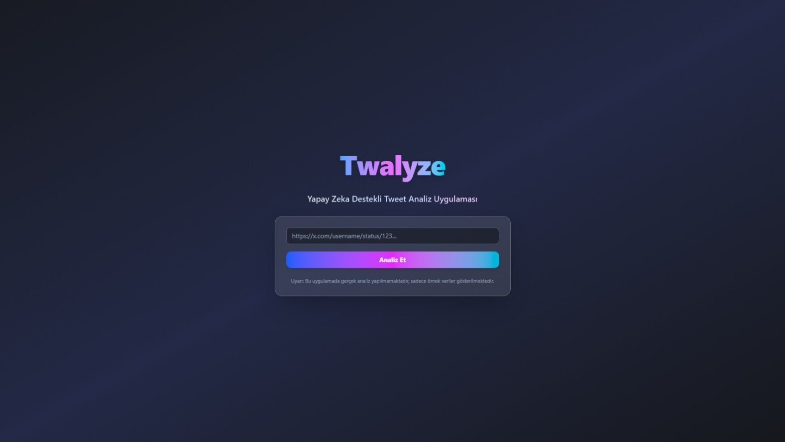

# Twalyze — Yapay Zeka Destekli Tweet Analiz Uygulaması

**Twalyze**, kullanıcıdan alınan bir **Tweet (X.com paylaşımı) URL’sini analiz ederek** paylaşımın yazarı, içeriği, duygusal tonu (Olumlu, Olumsuz, Nötr), kısa bir özet ve paylaşım tarihi gibi bilgileri kullanıcıya sunan yapay zekâ destekli modern bir web uygulamasıdır.

Analiz edilen her tweet, aynı zamanda otomatik olarak bir **Google Sheets** belgesine kaydedilir. Uygulama şu anda demo/test amaçlı olarak mock verilerle çalışmaktadır.

🔗 **Canlı Demo:** [twalyze-umutozturkkks-projects.vercel.app](https://twalyze-umutozturkkks-projects.vercel.app/)

---

## 🖼️ Uygulama Ekran Görüntüsü

Aşağıda Twalyze uygulamasının arayüzünden bir örnek yer almaktadır:

---

## 📊 Google Sheets Entegrasyonu

Uygulama her analiz sonucunu gerçek zamanlı olarak bağlı bir **Google Sheets** belgesine işler.

🔗 **Google Sheets bağlantısı:** [Tweet Analiz Kayıt Tablosu](https://docs.google.com/spreadsheets/d/16XqIKO4iVRCNXnp7An6NPQ7G_Fy4Bg_ctlKkLI6K8Gw/edit?usp=sharing)

Kayıt edilen bilgiler:
- Kullanıcı adı
- Tweet içeriği
- Duygusal ton
- Özet
- Tarih ve zaman

---

## ✨ Özellikler

- 🔗 Herhangi bir **Twitter / X bağlantısını** analiz et (şu anda *mock* veri üzerinden)
- 🧠 Yapay zekâ destekli **duygu analizi** ve **özet çıkarımı** (şu anda *mock* verilerle)
- 📊 Sonuçlar otomatik olarak **Google Sheets** belgesine kaydedilir
- 🌙 **Modern** kullanıcı arayüzü
- ⚙️ **Next.js** ve **Tailwind CSS** ile geliştirilmiştir

---

## 🖥️ Kullanılan Teknolojiler

- **Framework:** Next.js — React tabanlı full-stack framework
- **Stil:** Tailwind CSS
- **Veri Kaydı:** Google Sheets API

---

## 🛠️ Nasıl Çalışır?

1. Kullanıcı bir tweet URL’si girer
2. Tweet verileri (şimdilik simüle edilmiş) alınır
3. Yapay zekâ tarafından analiz edilir (duygu + özet)
4. Sonuçlar:
   - Ekranda gösterilir
   - Google Sheets belgesine eklenir

---
